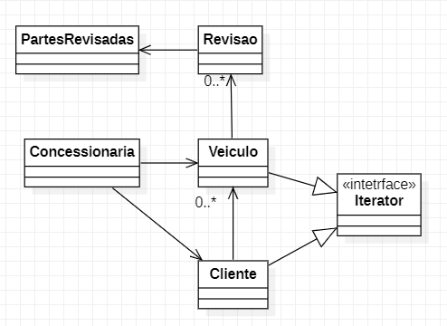

# Padrão Iterator

Padrão que permite percorrer elementos de uma coleção sem expor as representações dele (lista, pilha, árvore, etc.)  
O foco é fazer a travessia dos elementos de uma estrutura de dados complexas sequencialmente, tais como uma árvore.  

**Caso de uso**: Sistema de gerenciamento de uma concessionaria.    
Possui objeto complexo - Cliente contém multiplos veiculos e cada veiculo pode ter várias revisões.

```
ClienteX {
    DadosCliente {
        nome, 
        cpf
        telefone,
        email,
        veiculos [
                    {
                        marca,
                        modelo,
                        ano,
                        Revisoes [
                                    {
                                        data,
                                        preco,
                                        kilometragem,
                                        itens-revisados {
                                                "motor": false,
                                                "oleo": true,
                                                "balanceamento": true,
                                        }
                                    },
                                    {
                                        data,
                                        preco,
                                        kilometragem,
                                        itens-revisados {
                                                "motor": false,
                                                "oleo": true,
                                                "balanceamento": true,
                                        }
                                    },
                                ]
                    }
                ]
        }
}
```


